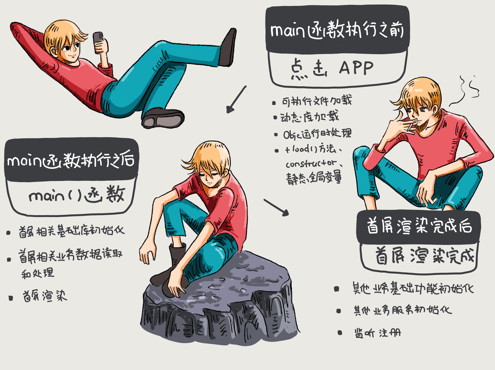

# App启动优化

## App启动类型

一般情况下App启动分为冷启动和热启动

- 冷启动是指App启动前他的进程不在系统里，需要系统给它创建一个新的进程分配给它启动的情况。这是一次完整的启动过程。
- 热启动是指App冷启动之后（也就是进程已经在系统里）用户将其退入后台，此时App的进程还在系统里，这个时候用户重新进入App的过程，当然这个过程可以做的事非常的少。

其实由这两点可以知道，启动优化大多数还是针对冷启动，这是App一个完整的启动过程。

## App启动三阶段（App启动都做了什么事）

1. main()函数执行前
2. main()函数执行后
3. 首屏渲染完成后

如下图：


### main()函数执行前

在 main() 函数执行前，系统主要会做下面几件事情：

- 加载可执行文件（App 的.o 文件的集合）；
- 加载动态链接库（dyld，一个专门用来加载动态链接库的库），进行 rebase 指针调整和 bind 符号绑定；（系统先读取App的可执行文件（Mach-O文件），从里面获得dyld的路径，然后加载dyld，dyld去初始化运行环境，开启缓存策略，加载程序相关依赖库(其中也包含我们的可执行文件)，并对这些库进行链接，最后调用每个依赖库的初始化方法，在这一步，runtime被初始化。当所有依赖库的初始化后，轮到最后一位(程序可执行文件)进行初始化，在这时runtime会对项目中所有类进行类结构初始化，然后调用所有的load方法。最后dyld返回main函数地址，main函数被调用，我们便来到了熟悉的程序入口。）
- Objc 运行时的初始处理，包括 Objc 相关类的注册、category 注册、selector 唯一性检查等；
- 初始化，包括了执行 +load() 方法、attribute((constructor)) 修饰的函数的调用、创建 C++ 静态全局变量。

#### 具体如下

App开始启动后，系统首先加载可执行文件（自身App的所有.o文件的集合），然后加载动态链接器dyld，dyld是一个专门用来加载动态链接库的库。 执行从dyld开始，dyld从可执行文件的依赖开始, 递归加载所有的依赖动态链接库。 动态链接库包括：iOS 中用到的所有系统 framework，加载OC runtime方法的libobjc，系统级别的libSystem，例如libdispatch(GCD)和libsystem_blocks (Block)。

#### 所以相应地，这个阶段对于启动速度优化来说，可以做的事情包括

- 减少动态库加载。每个库本身都有依赖关系，苹果公司建议使用更少的动态库，并且建议在使用动态库的数量较多时，尽量将多个动态库进行合并。数量上，苹果公司建议最多使用 6 个非系统动态库。
- 减少加载启动后不会去使用的类或者方法。
- +load() 方法里的内容可以放到首屏渲染完成后再执行，或使用 +initialize() 方法替换掉。因为，在一个 +load() 方法里，进行运行时方法替换操作会带来 4 毫秒的消耗。不要小看这 4 毫秒，积少成多，执行 +load() 方法对启动速度的影响会越来越大。（+load 方法会在加载类的时候就被调用，也就是 ios 应用启动的时候，就会加载所有的类，就会调用每个类的 + load 方法，而+initialize()是在第一次初始化这个类之前 被调用，我们用它来初始化静态变量。）
- 控制 C++ 全局变量的数量。

### main()函数执行之后

main() 函数执行后的阶段，指的是从 main() 函数执行开始，到 appDelegate 的 didFinishLaunchingWithOptions 方法里首屏渲染相关方法执行完成。

首页的业务代码都在这个阶段，也就是在首屏渲染之前，主要包括了：

- 首屏初始化所需要配置文件的读写操作；
- 首屏列表等大数据的读取；
- 首屏渲染的大量计算。
  
很多时候各种初始化也会放在这个阶段执行，导致渲染完成之后。更加优化的方式应该从功能上梳理哪些是必要的初始化功能，部分使用到对应功能再初始化的则放到对应的阶段即可。

### 首屏渲染完成之后

这个阶段主要是其他非首屏业务的服务模块的初始化、监听的注册、配置文件的读取等。从函数来看，这个阶段指的就是截止到 didFinishLaunchingWithOptions 方法作用域内执行首屏渲染之后的所有方法执行完成。简单说的话，这个阶段就是从渲染完成时开始，到 didFinishLaunchingWithOptions 方法作用域结束时结束。

### 功能级别启动优化

功能级别的启动优化，就是要从 main() 函数执行后这个阶段下手。优化的思路是： main() 函数开始执行后到首屏渲染完成前只处理首屏相关的业务，其他非首屏业务的初始化、监听注册、配置文件读取等都放到首屏渲染完成后去做。如下图所示：



### 方法级别的启动优化

检查首屏渲染完成前主线程上有哪些耗时方法，将没必要的耗时方法滞后或者异步执行。通常情况下，耗时较长的方法主要发生在计算大量数据的情况下，具体的表现就是加载、编辑、存储图片和文件等资源。

对 App 启动速度的监控，主要有两种手段。

**第一种方法是，定时抓取主线程上的方法调用堆栈，计算一段时间里各个方法的耗时。** Xcode 工具套件里自带的 Time Profiler ，采用的就是这种方式。

这种方式的优点是，开发类似工具成本不高，能够快速开发后集成到你的 App 中，以便在真实环境中进行检查。说到定时抓取，就会涉及到定时间隔的长短问题。定时间隔设置得长了，会漏掉一些方法，从而导致检查出来的耗时不精确；而定时间隔设置得短了，抓取堆栈这个方法本身调用过多也会影响整体耗时，导致结果不准确。这个定时间隔如果小于所有方法执行的时间（比如 0.002 秒），那么基本就能监控到所有方法。但这样做的话，整体的耗时时间就不够准确。一般将这个定时间隔设置为 0.01 秒。这样设置，对整体耗时的影响小，不过很多方法耗时就不精确了。但因为整体耗时的数据更加重要些，单个方法耗时精度不高也是可以接受的，所以这个设置也是没问题的。总结来说，定时抓取主线程调用栈的方式虽然精准度不够高，但也是够用的。

**第二种方法是，对 objc_msgSend 方法进行 hook 来掌握所有方法的执行耗时。**hook 方法的意思是，在原方法开始执行时换成执行其他你指定的方法，或者在原有方法执行前后执行你指定的方法，来达到掌握和改变指定方法的目的。hook objc_msgSend 这种方式的优点是非常精确，而缺点是只能针对 Objective-C 的方法。当然，对于 c 方法和 block 也不是没有办法，你可以使用 libffi 的 ffi_call 来达成 hook，但缺点就是编写维护相关工具门槛高。

如何 hook objc_msgSend 方法可以看一下fishhook开源库。

fishhook 实现的大致思路是，通过重新绑定符号，可以实现对 c 方法的 hook。dyld 是通过更新 Mach-O 二进制的 __DATA segment 特定的部分中的指针来绑定 lazy 和 non-lazy 符号，通过确认传递给 rebind_symbol 里每个符号名称更新的位置，就可以找出对应替换来重新绑定这些符号。

首先，遍历 dyld 里的所有 image，取出 image header 和 slide。代码如下：

``` Objective-c
if (!_rebindings_head->next) { 
    _dyld_register_func_for_add_image(_rebind_symbols_for_image);
    } else { 
        uint32_t c = _dyld_image_count(); // 遍历所有 image 
        for (uint32_t i = 0; i < c; i++) { // 读取 image header 和 slider 
            _rebind_symbols_for_image(_dyld_get_image_header(i), _dyld_get_image_vmaddr_slide(i)); 
        }
    }
```
