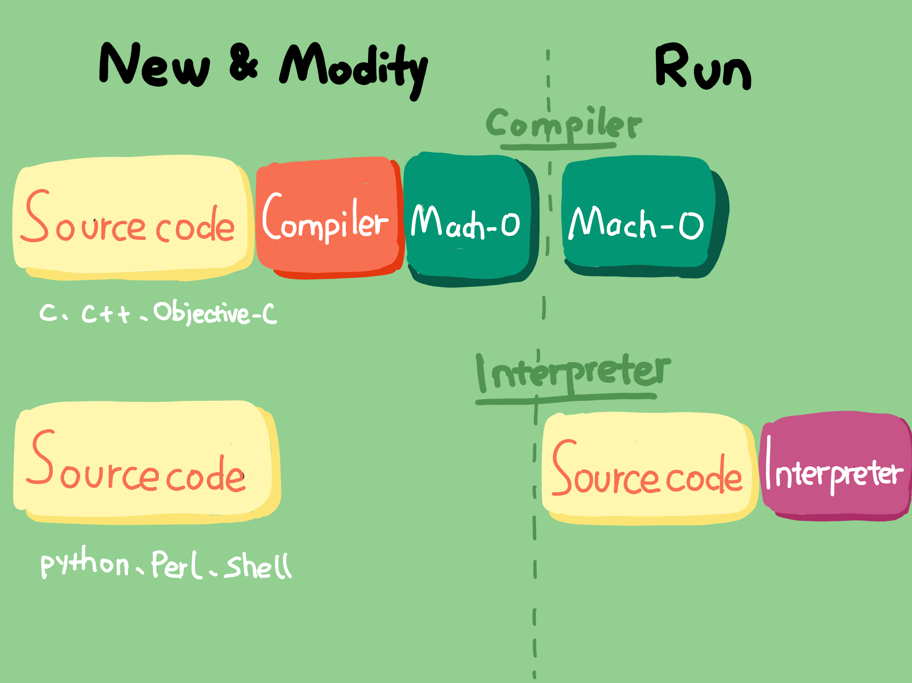
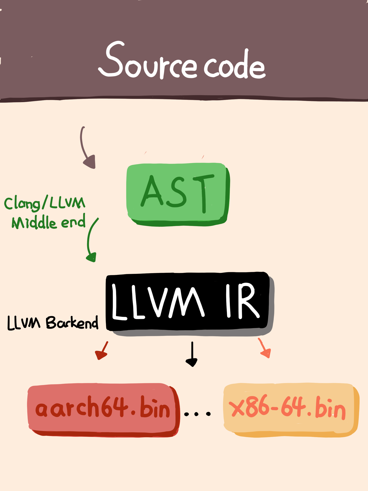

# 链接器：符号如何绑定到地址上

## 链接器的主要作用

链接器的主要作用就是将符号绑定到地址上。

## iOS开发为什么使用的是编译器

iOS编写的代码是先用编译器把代码编译成机器码，然后直接在CPU上执行机器码的。没有使用解释器运行代码是因为速度不够快，因为解释器会在运行时解释代码，获取一段代码后就会将其翻译成目标代码（就是字节码），然后一句一句的执行目标代码。也就是说解释器是在运行时才去解析代码，这就比编译器生成一份完整的机器码再去执行的效率要低。

解释器可以在运行时去执行代码，说明它具有动态性，程序运行后能够随时通过增加和更新代码来改变程序的逻辑。也就是说，你写的程序跑起来后不用重新启动，就可以看到代码修改后的效果，这样就缩短了调试周期。程序发布后，你还可以随时修复问题或者增加新功能，用户也不用一定要等到发布新版本后才可以升级使用。所以说，使用解释器可以帮我们缩短整个程序的开发周期和功能更新周期。

编译器和解释器执行代码的特点，我们可以概括如下：

- 采用编译器生成机器码执行的好处是效率高，缺点是调试周期长。
- 解释器执行的好处是编写调试方便，缺点是执行效率低。

编译器和解释器的比较如下图：



## iOS开发使用的是什么编译器

现在苹果公司使用的编译器是 LLVM，相比于 Xcode 5 版本前使用的 GCC，编译速度提高了 3 倍。同时，苹果公司也反过来主导了 LLVM 的发展，让 LLVM 可以针对苹果公司的硬件进行更多的优化。

总结来说，LLVM 是编译器工具链技术的一个集合。而其中的 lld 项目，就是内置链接器。编译器会对每个文件进行编译，生成 Mach-O（可执行文件）；链接器会将项目中的多个 Mach-O 文件合并成一个。总结来说，LLVM 是编译器工具链技术的一个集合。而其中的 lld 项目，就是内置链接器。编译器会对每个文件进行编译，生成 Mach-O（可执行文件）；链接器会将项目中的多个 Mach-O 文件合并成一个。

LLVM编译的主要过程：

- 首先，你写好代码后，LLVM 会预处理你的代码，比如把宏嵌入到对应的位置。
- 预处理完后，LLVM 会对代码进行词法分析和语法分析，生成 AST 。AST 是抽象语法树，结构上比代码更精简，遍历起来更快，所以使用 AST 能够更快速地进行静态检查，同时还能更快地生成 IR（中间表示）。
- 最后 AST 会生成 IR，IR 是一种更接近机器码的语言，区别在于和平台无关，通过 IR 可以生成多份适合不同平台的机器码。对于 iOS 系统，IR 生成的可执行文件就是 Mach-O。

 

## 编译时链接器做了什么

Mach-O文件里的内容主要就是代码和数据:

- 代码是函数的定义；
- 数据是全局变量的定义，包括全局变量的初始值。

不管是代码还是数据，他们的实例都需要由符号将其关联起来。原因是Mach-O文件里的代码如if、for、while生成的机器指令序列，要操作的数据会存储在某个地方，变量符号就需要绑定到数据的存储地址。代码中引用其他的代码，引用的函数符号也需要绑定到该函数的地址。链接器的作用就是完成变量、函数符号和其他地址绑定这样的任务。这里我们说的符号就可以理解为变量名和函数名。

### 链接器做符号和地址绑定

如果地址和符号不做绑定的话，要让机器知道你在操作什么内存地址，你就需要在写代码时给每个指令设好内存地址（main函数执行前，有一个步骤是：加载动态链接库，进行 rebase 指针调整和 bind 符号绑定；这就解释了为什么要进行符号绑定。）。写这样的代码的过程，就像你直接在和不同平台的机器沟通，连编译生成 AST 和 IR 的步骤都省掉了，甚至优化平台相关的代码都需要你自己编写。这要做的后果就是可读性和维护性都很差，单单对地址的维护就会让人崩溃。而且还会产生很多重复的工作，因为要针对不同的平台写多分代码，而这个本可以使用高级语言一次编译成多分。

### 链接器为什么要把项目中的多个Mach-O文件合并成一个

项目中文件之间的变量和接口函数都是相互依赖的，所以这时我们就需要通过链接器将项目中生成的多个 Mach-O 文件的符号和地址绑定起来。没有这个绑定过程的话，单个文件生成的 Mach-O 文件是无法正常运行起来的。因为，如果运行时碰到调用在其他文件中实现的函数的情况时，就会找不到这个调用函数的地址，从而无法继续执行。

链接器在链接多个目标文件的过程中，会创建一个符号表，用于记录所有已定义的和所有未定义的符号。链接时如果出现相同符号的情况，就会出现“ld: dumplicate symbols”的错误信息；如果在其他目标文件里没有找到符号，就会提示“Undefined symbols”的错误信息。

### 链接器对代码主要做了哪几件事

- 去项目文件里查找目标代码文件里没有定义的变量。
- 扫描项目中的不同文件，将所有符号定义和引用地址收集起来，并放到全局符号表中。
- 计算合并后长度及位置，生成同类型的段进行合并，建立绑定。
- 对项目中不同文件里的变量进行地址重定位。

#### 链接器在整理函数的符号调用关系时如何整理无用函数并自动去除？

链接器在整理函数的调用关系时，会以 main 函数为源头，跟随每个引用，并将其标记为 live。跟随完成后，那些未被标记 live 的函数，就是无用函数。然后，链接器可以通过打开 Dead code stripping 开关，来开启自动去除无用代码的功能。并且，这个开关是默认开启的。

### 动态库链接

在真实的 iOS 开发中，多功能都是现成可用的，不光你能够用，其他 App 也在用，比如 GUI 框架、I/O、网络等。链接这些共享库到你的 Mach-O 文件，也是通过链接器来完成的。

**链接的共用库分为静态库和动态库：静态库是编译时链接的库，需要链接进你的 Mach-O 文件里，如果需要更新就要重新编译一次，无法动态加载和更新；而动态库是运行时链接的库，使用 dyld 就可以实现动态加载。** （PS：目前动态库大多数时候还是启动的时候链接的。可以使用动态库懒加载技术实现启动后懒加载）

Mach-O 文件是编译后的产物，而动态库在运行时才会被链接，并没参与 Mach-O 文件的编译和链接，所以 Mach-O 文件中并没有包含动态库里的符号定义。也就是说，这些符号会显示为“未定义”，但它们的名字和对应的库的路径会被记录下来。运行时通过 dlopen 和 dlsym 导入动态库时，先根据记录的库路径找到对应的库，再通过记录的名字符号找到绑定的地址。

dlopen 会把共享库载入运行进程的地址空间，载入的共享库也会有未定义的符号，这样会触发更多的共享库被载入。dlopen 也可以选择是立刻解析所有引用还是滞后去做。dlopen 打开动态库后返回的是引用的指针，dlsym 的作用就是通过 dlopen 返回的动态库指针和函数符号，得到函数的地址然后使用。

**使用 dyld 加载动态库，有两种方式**：有程序启动加载时绑定和符号第一次被用到时绑定。为了减少启动时间，大部分动态库使用的都是符号第一次被用到时再绑定的方式。

加载过程开始会修正地址偏移，iOS 会用 ASLR 来做地址偏移避免攻击，确定 Non-Lazy Pointer 地址进行符号地址绑定，加载所有类，最后执行 load 方法和 Clang Attribute 的 constructor 修饰函数。

每个函数、全局变量和类都是通过符号的形式定义和使用的，当把目标文件链接成一个 Mach-O 文件时，链接器在目标文件和动态库之间对符号做解析处理。

#### dyld的链接过程

**第一步：先编写多个文件。**

Boy.h

``` Objective-C
#import <Foundation/Foundation.h>
@interface Boy : NSObject
- (void)say;
@end
```

Boy.m

``` Objective-C
#import “Boy.h”
@implementation Boy
- (void)say
{
    NSLog(@“hi there again!\n”);
}
@end
```

SayHi.m

``` Objective-C
#import “Boy.h”
int main(int argc, char *argv[])
{
    @autoreleasepool {
        Boy *boy = [[Boy alloc] init];
        [boy say];
        return 0;
    }
}
```